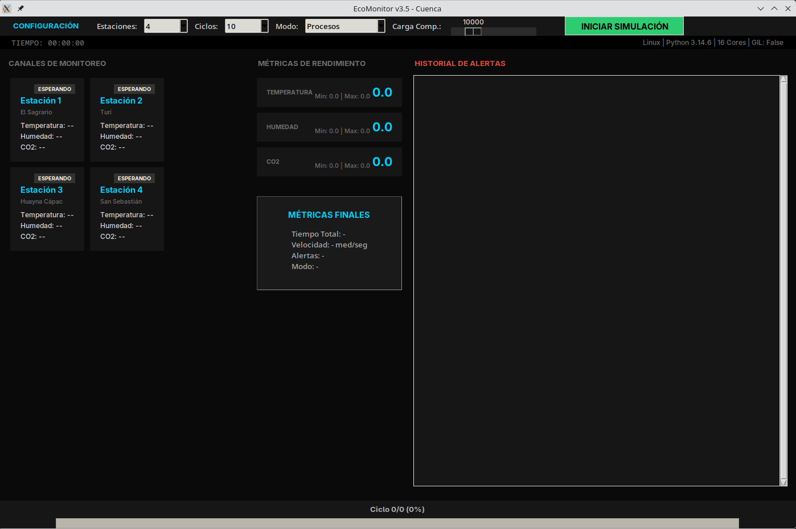
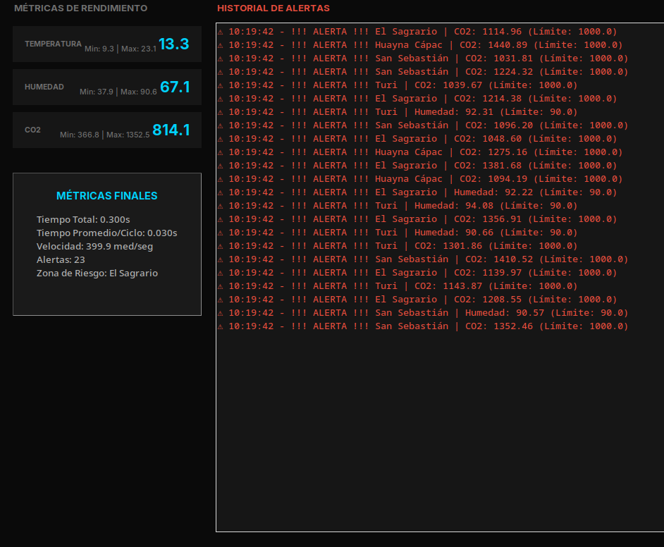
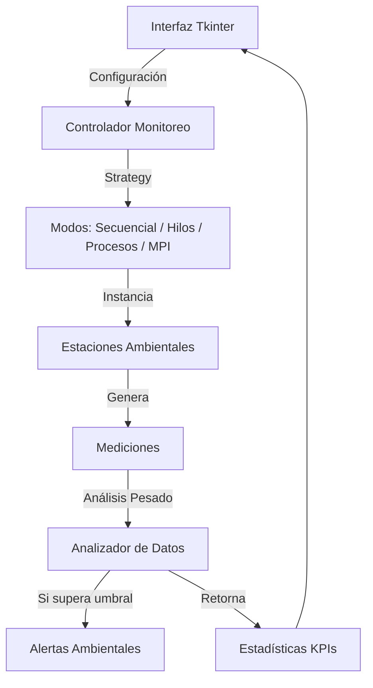

# Práctica 4: Monitoreo Ambiental Concurrente en Python

Este proyecto simula un sistema urbano de monitoreo ambiental para la ciudad de Cuenca, aplicando conceptos de paralelismo y concurrencia.

Simula estaciones distribuidas que miden Temperatura, Humedad y CO2, utilizando cuatro paradigmas de programación en Python: **Secuencial**, **Multiprocessing** (Paralelismo local), **Threading** (Concurrencia local) y **MPI** (Paso de mensajes en clúster utilizando múltiples computadoras).

---

## Instalación y Requisitos (Clúster de 3 Computadoras Físicas)

Para ejecutar la versión distribuida con MPI a través de una red local real usando 3 PCs físicas (en entornos basados en **Arch Linux / Manjaro**), se requiere cumplir con las siguientes condiciones de compatibilidad y red:

### Requisitos Obligatorios
1. **Misma versión de Python:** Cada uno de los 3 nodos del clúster físico debe utilizar **exactamente la misma versión de Python** (por ejemplo: `3.13.x` o `3.14.x`). Diferencias de versión causarán errores de serialización con `mpi4py`.
2. **Dependencias del Sistema (Arch Linux / Manjaro):**
   * Configurar **MPICH** y **SSH** en todas las computadoras.
   * Instalar el soporte de almacenamiento en red (`cifs-utils` y `samba`).

### Paso 1: Clonación del Repositorio (Clonar la rama mpi)
Clona el repositorio directamente apuntando a la rama del proyecto que contiene la implementación de MPI:
```bash
git clone -b mpi https://github.com/KarenS22/Simulador-Ambiental.git
cd Simulador-Ambiental
```

### Paso 2: Instalación de Dependencias
Instalar `mpi4py` (en cada máquina):
```bash
pip install mpi4py
```

### Paso 3: Configurar Acceso SSH sin Contraseña
Para que MPI pueda iniciar los procesos trabajadores de forma remota, el nodo coordinador debe comunicarse con los esclavos sin que se le solicite contraseña:
* Generar llaves ed25519/rsa en la máquina coordinadora.
* Copiar la llave pública del coordinador a todos los nodos del clúster (`ssh-copy-id`) para habilitar el ingreso directo por SSH.

### Paso 4: Montar Carpeta Compartida (`cifs-utils` y Samba)
Para garantizar que todos los nodos ejecuten la misma versión del código y lean los mismos archivos, la máquina principal comparte la carpeta del proyecto a través de Samba para que las demás la monten:

1. **PC Principal:** Monta el servidor Samba compartiendo la carpeta del proyecto.
2. **PC Secundarias (Nodos Esclavos):** Instalar el cliente y montar la carpeta compartida en una ruta absoluta idéntica (ejemplo: `/home/flamenco/home`):
   ```bash
   sudo pacman -S cifs-utils
   sudo mkdir -p /home/flamenco/home
   
   # Comando de montaje
   sudo mount -t cifs //IP_COORD/Simulador-Ambiental /home/flamenco/home -o username=usuario_samba,password=clave_samba,uid=$UID,gid=$(id -g)
   ```

---

## Ejecución

### Ejecución Local Estándar (Modos: Secuencial, Hilos, Procesos)
Para probar localmente de manera clásica:
```bash
python3 main.py
```

### Ejecución con MPI (Clúster Distribuido)
Para arrancar la simulación sobre las 3 máquinas físicas conectadas:

1. **Configurar hosts (`mpi_hosts`):**
   Asegúrate de que el archivo `mpi_hosts` en la carpeta compartida del proyecto tenga la estructura de estos nodos:
   ```text
   cthulhu:4
   slave2:4
   slave1:4
   ```
2. **Ejecutar el comando desde el Coordinador (`cthulhu`):**
   ```bash
   mpiexec -f mpi_hosts -n 11 python3 /home/flamenco/home/main.py
   ```
   * **Nodo Coordinador (cthulhu):** Levantará la interfaz gráfica (GUI) y procesará los eventos.
   * **Nodos Esclavos (slave1, slave2):** Reciben comandos por red vía SSH de manera imperceptible y procesan las simulaciones de las estaciones asignadas, enviando resultados en tiempo real al coordinador.

---

## Interfaz de Usuario
A continuación se muestra la interfaz gráfica del sistema:

| Dashboard Principal | Estadísticas y Alertas |
| :---: | :---: | 
|  |  |

---

## Comparativa de Rendimiento

Los resultados obtenidos muestran la escalabilidad del sistema en tres niveles de prueba (16 núcleos, Carga 10,000):

| Simulación | Secuencial | Hilos (Threading) | Procesos (Multproc.) | MPI (Clúster) |
| :--- | :---: | :---: | :---: | :---: |
| **4 Est. / 10 Ciclos** | 4.05s | **0.19s** | 0.28s | *Pendiente* |
| **8 Est. / 20 Ciclos** | 17.23s | **0.78s** | 0.86s | *Pendiente* |
| **12 Est. / 30 Ciclos** | 39.61s | **1.75s** | 1.97s | *Pendiente* |

> **Análisis del GIL y Clúster:** Al utilizar Python (Free-threaded), la versión de hilos no se ve penalizada por el GIL. Hilos e IPC son excelentes localmente. En la versión paralela con MPI, el procesamiento pesado se distribuye físicamente de manera balanceada en nodos de red distribuidos mediante túneles de comunicación estructurados sobre SSH.

---

## Arquitectura del Proyecto



---

## Estructura del Proyecto
- `core/`: Lógica central (módulos secuencial, hilos, procesos y mpi con sus respectivos controladores y workers).
- `models/`: Clases de datos (Estación, Medición, Alerta).
- `gui/`: Interfaz gráfica con Tkinter.
- `main.py`: Punto de entrada del sistema.