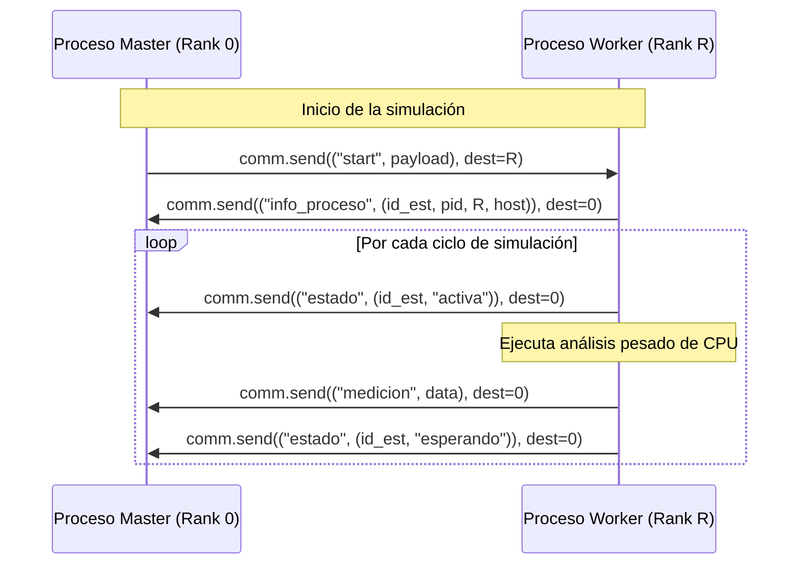

# Arquitectura del Proceso MPI en el Simulador

---

## Diapositiva 1: Roles y Arquitectura Master-Worker

El sistema distribuye la ejecución de las estaciones ambientales a lo largo de un clúster utilizando la biblioteca `mpi4py`.

* **Proceso Master (Rank 0):**
  * **Coordinador y GUI:** Ejecuta la interfaz gráfica y gestiona el flujo de simulación.
  * **Procesamiento Local:** Si hay estaciones asignadas a él (mediante `id % size == 0`), las procesa localmente en un hilo secundario para mantener la GUI responsiva.
  * **Recepción de Datos:** Escucha y recopila en bucle los mensajes enviados por los trabajadores.
* **Procesos Workers (Ranks 1 a N):**
  * **Simulación Paralela:** Esperan la señal del Master, ejecutan la carga computacional intensiva de las estaciones asignadas, y retornan los resultados.

---

## Diapositiva 2: Flujo de Mensajes y Comunicación

El intercambio de datos se realiza mediante mensajes asíncronos punto a punto en el comunicador global `MPI.COMM_WORLD`.

* **Mensajes Clave:**
  * `start`: Envía los ciclos, la carga y la lista de estaciones asignadas al worker.
  * `info_proceso`: Informa a la GUI el PID, Rank y Hostname resuelto del worker.
  * `medicion` y `estado`: Envían métricas en tiempo real.

---

## Diapositiva 3: Distribución de Carga y Sincronización

* **Distribución de Estaciones (`Modulo size`):**
  * Las $E$ estaciones se distribuyen de forma balanceada entre los $P$ procesos usando `r = i % size`.
  * Si $P$ es igual a la cantidad de estaciones, cada estación se ejecuta en su propio proceso dedicado (incluyendo el Rank 0).
* **Sincronización por Barrera (`comm.Barrier()`):**
  * Al final de cada ciclo de medición, tanto el Master (Rank 0) como todos los Workers llaman a `comm.Barrier()`.
  * Esto bloquea la ejecución del proceso hasta que todos los demás miembros del clúster hayan finalizado sus cómputos de ese ciclo, evitando desalineación temporal en las lecturas.
