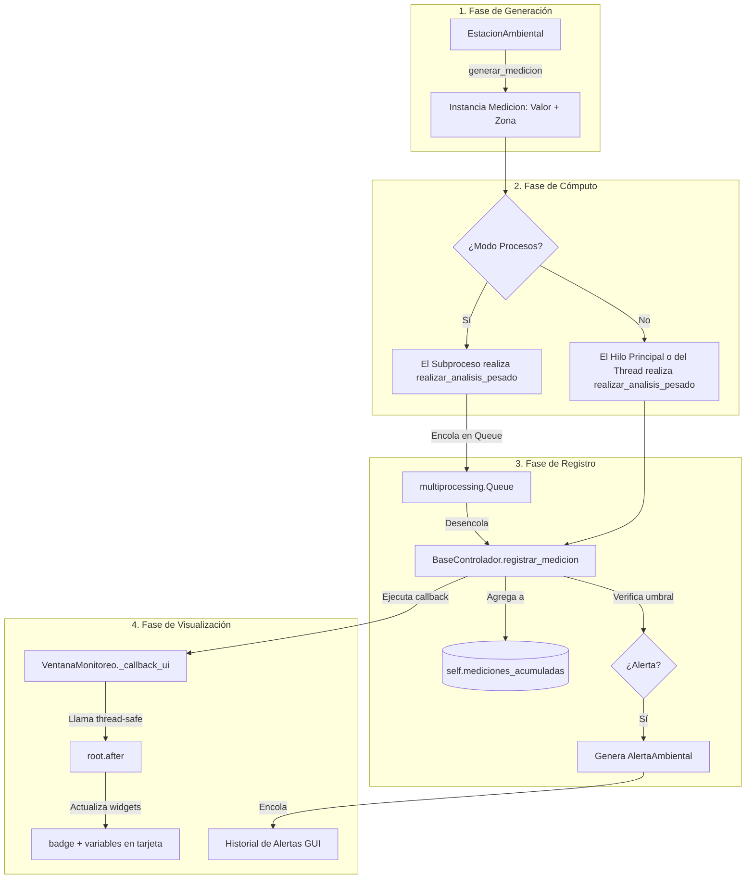

# Explicación del Funcionamiento del Sistema de Monitoreo Ambiental

Este documento detalla la arquitectura de software, la estructura del proyecto, el funcionamiento lógico de los diferentes modos de ejecución (Secuencial, Hilos y Procesos) y realiza un trazado completo del flujo de datos.

---

## 1. Estructura de Archivos del Proyecto

El sistema está organizado de manera modular bajo un patrón similar a MVC (Modelo-Vista-Controlador):

```
Simulador-Ambiental/
├── core/
│   ├── base_analizador.py        # Clase base con algoritmos de CPU intensivos y alertas.
│   ├── base_controlador.py       # Clase base con inicialización de estaciones y registro.
│   ├── secuencial/               # Módulo Secuencial
│   │   ├── __init__.py
│   │   ├── analizador.py
│   │   └── controlador.py
│   ├── hilos/                    # Módulo Concurrente basado en Hilos
│   │   ├── __init__.py
│   │   ├── analizador.py
│   │   └── controlador.py
│   └── procesos/                  # Módulo Paralelo basado en Procesos
│       ├── __init__.py
│       ├── analizador.py
│       └── controlador.py
├── models/
│   ├── alerta.py                 # Modelo AlertaAmbiental.
│   ├── estacion.py               # Modelo EstacionAmbiental (genera mediciones aleatorias).
│   └── medicion.py               # Modelo Medicion (almacena valores individuales).
├── gui/
│   └── ventana.py                # Interfaz gráfica (Tkinter) moderna y oscura.
├── main.py                       # Punto de entrada de la aplicación (Modo CLI y GUI).
└── explicacion.md                # Este archivo de documentación.
```

---

## 2. Funcionamiento Lógico e Infraestructura de Concurrencia

El sistema utiliza el **Patrón Strategy** para instanciar el motor de ejecución correcto (`secuencial`, `hilos`, o `procesos`) de forma transparente para el cliente (GUI o CLI).

### A. Clases Base
* **`BaseAnalizador`**: Contiene la lógica matemática para verificar umbrales de alerta e identificar zonas de riesgo. Incluye `realizar_analisis_pesado()` que ejecuta ciclos intensivos de cálculo ($O(N)$ iteraciones matemáticas) para simular carga computacional real sobre la CPU.
* **`BaseControlador`**: Administra la inicialización de las estaciones urbanas de Cuenca, gestiona la estructura de datos en memoria para almacenar las mediciones del historial y notifica actualizaciones a la UI a través de un callback.

### B. Modos de Ejecución

#### 1. Modo Secuencial (`core/secuencial/`)
* **Lógica**: Todo corre de forma iterativa y lineal en un único flujo de ejecución secuencial.
* **Flujo**: Estación por estación, ciclo por ciclo. No utiliza ningún hilo adicional, semáforo, lock o mecanismo de sincronización concurrentes.

#### 2. Modo Hilos (`core/hilos/`)
* **Lógica**: Crea un hilo (`threading.Thread`) para cada estación. Los hilos compiten de forma concurrente, pero están restringidos por el GIL de Python.
* **Sincronización**: Utiliza un `threading.Barrier` al final de cada ciclo para forzar a que todas las estaciones completen el ciclo actual antes de que cualquiera comience el siguiente (balanceo de tomas de datos).

#### 3. Modo Procesos (`core/procesos/`)
* **Lógica**: Crea un subproceso real del sistema operativo (`multiprocessing.Process`) por cada estación. Esto evade el GIL de Python y distribuye la carga pesada eficientemente entre los núcleos físicos de la CPU.
* **Distribución de Carga**: El análisis pesado de CPU (`realizar_analisis_pesado`) se ejecuta **dentro del subproceso**. Los subprocesos ponen los datos procesados en un canal compartido (`multiprocessing.Queue`). El hilo principal solo se encarga de desencolar e imprimir los datos velozmente sin retrasar la UI.
* **Sincronización**: Un `multiprocessing.Barrier` sincroniza el paso de ciclo de los procesos hijos.

---

## 3. Trazado y Flujo de Datos

El siguiente diagrama detalla cómo se origina un dato de medición ambiental, cómo se procesa concurrentemente y cómo se visualiza en la interfaz gráfica.

### Diagrama de Flujo (Trazado de una Medición)



### Explicación Paso a Paso del Tranzado:

1. **Generación del Dato**:
   La clase `EstacionAmbiental` ejecuta `generar_mediciones_ciclo()`, instanciando tres objetos `Medicion` (Temperatura, Humedad, CO2) con valores aleatorios realistas y la zona geográfica correspondiente (ej: "Turi", "El Sagrario").

2. **Cómputo CPU Pesado**:
   - En **Secuencial/Hilos**: Las mediciones se pasan a `analizador.procesar_mediciones()`, que realiza cálculos repetitivos de raíz cuadrada y logaritmos (determinado por el slider de carga computacional).
   - En **Procesos**: Este costoso procesamiento se ejecuta en el proceso hijo correspondiente a la estación.

3. **Registro de Mediciones**:
   La medición se añade a la lista `self.mediciones_acumuladas` del controlador. Se ejecuta la verificación de umbrales en el analizador. Si el valor de la medición excede el umbral de seguridad, se instancia un objeto `AlertaAmbiental` y se agrega a `self.alertas`.

4. **Notificación y Actualización de UI**:
   El controlador invoca a `self.callback_ui(tipo, data)`. Dado que la UI (Tkinter) no es segura para subprocesos, la función redirige la actualización a través de `self.root.after(0, self._process_update, tipo, data)`. Esto coloca la actualización visual en la cola de eventos de Tkinter para que el hilo principal dibuje de forma segura los nuevos valores de Temperatura/Humedad/CO2, encienda la alerta en color rojo y refresque el progreso.
