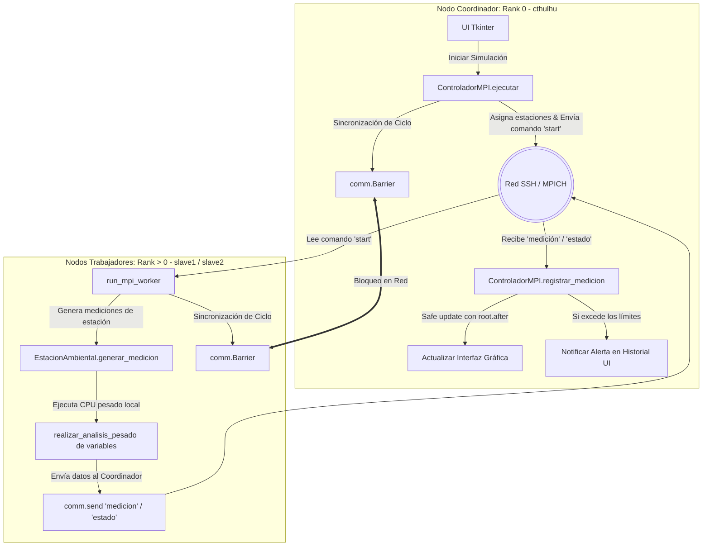

# Explicación del Funcionamiento del Sistema de Monitoreo Ambiental (Enfoque MPI)

Este documento detalla la arquitectura de software, la estructura del proyecto, el funcionamiento lógico de los diferentes modos de ejecución (priorizando el modelo distribuido MPI) y realiza un trazado del flujo de datos de la aplicación.

---

## 1. Estructura de Archivos del Proyecto

El sistema está organizado de manera modular bajo un patrón similar a MVC (Modelo-Vista-Controlador):

```
Simulador-Ambiental/
├── core/
│   ├── base_analizador.py        # Clase base con algoritmos de CPU intensivos y alertas.
│   ├── base_controlador.py       # Clase base con inicialización de estaciones y registro.
│   ├── secuencial/               # Módulo Secuencial
│   │   ├── analizador.py
│   │   └── controlador.py
│   ├── hilos/                    # Módulo Concurrente basado en Hilos
│   │   ├── analizador.py
│   │   └── controlador.py
│   ├── procesos/                 # Módulo Paralelo basado en Procesos Locales
│   │   ├── analizador.py
│   │   └── controlador.py
│   └── mpi/                      # Módulo Paralelo Distribuido (MPI) con MPICH
│       ├── __init__.py
│       ├── analizador.py         # Subclase del analizador para el entorno MPI
│       ├── controlador.py        # Controlador Coordinador (Rank 0)
│       └── worker.py             # Lógica del Proceso Trabajador (Rank > 0)
├── models/
│   ├── alerta.py                 # Modelo AlertaAmbiental
│   ├── estacion.py               # Modelo EstacionAmbiental (genera mediciones)
│   └── medicion.py               # Modelo Medicion (almacena temperatura/humedad/CO2)
├── gui/
│   └── ventana.py                # Interfaz gráfica moderna (Tkinter)
├── main.py                       # Punto de entrada (Redirige Ranks y lanza GUI)
├── mpi_hosts                     # Configuración de nodos del clúster (cthulhu, slave1, slave2)
└── README.md                     # Documentación de instalación y ejecución en clúster
```

---

## 2. Funcionamiento de Concurrencia y Paralelismo (Enfoque MPI)

El sistema utiliza el **Patrón Strategy** para instanciar el controlador correcto (`secuencial`, `hilos`, `procesos` o `mpi`).

### A. Ejecución de MPI vs Modos Locales
* **Secuencial / Hilos / Procesos:** Se ejecutan de manera local compartiendo la misma máquina física.
* **MPI (Message Passing Interface - MPICH):** Corre distribuido a través de una red física de computadoras. Cada equipo ejecuta su propio proceso con un espacio de memoria totalmente independiente.

### B. Arquitecturas y Mecánicas de MPI

#### 1. Bifurcación Master/Worker (`main.py`)
Al iniciar la aplicación mediante `mpiexec`, todos los procesos asignados en `mpi_hosts` se cargan simultáneamente. Para evitar que todas las computadoras abran la interfaz gráfica o colisionen:
* **Si `Rank == 0` (Coordinador - cthulhu):** Se ejecuta el flujo principal de control y levanta la GUI en Tkinter.
* **Si `Rank > 0` (Trabajadores - slave1, slave2):** Se desvía de inmediato el hilo de ejecución hacia `run_mpi_worker()` en `core/mpi/worker.py` y se bloquea a la espera de instrucciones de trabajo de `Rank 0`.

#### 2. Reparto de Trabajo Dinámico (`core/mpi/controlador.py`)
El controlador del nodo maestro calcula de manera equitativa la distribución de estaciones entre los Ranks disponibles:
* Si hay $N$ computadores (o slots), se asigna de forma cíclica: `rank_trabajador = 1 + (indice_estacion % (total_ranks - 1))`.
* El coordinador envía la configuración a cada trabajador mediante un paquete serializado (ciclos, carga, objeto estación) utilizando `comm.send()`.

#### 3. Sincronización en Red (`comm.Barrier()`)
Dado que las estaciones físicas tienen diferentes capacidades de procesamiento y tiempos de respuesta de red:
* Se implementa un punto de sincronización colectivo (`comm.Barrier()`) al final de cada ciclo de simulación.
* Ningún trabajador ni el coordinador iniciará el ciclo siguiente hasta que el último nodo haya completado su ciclo actual y enviado sus mediciones correspondientes.

#### 4. Apagado Limpio (`atexit`)
Cuando la interfaz gráfica es cerrada en `cthulhu` (Rank 0), un manejador `atexit.register` envía automáticamente un mensaje de apagado (`"exit"`) a todos los workers activos y cierra sus procesos de red limpiamente.

---

## 3. Trazado y Flujo de Datos en Modo MPI

El siguiente diagrama ilustra el flujo de una medición ambiental cuando se ejecuta en el modo distribuido con MPI a través de la red:



### Explicación del Tránsito del Dato en MPI:
1. **Delegación de Tarea:**
   El Coordinador (`cthulhu`) arranca la interfaz. Cuando el usuario hace clic en "INICIAR SIMULACIÓN", el motor de MPI envía dinámicamente un payload a través de `mpi4py` a `slave1` y `slave2` con sus estaciones asignadas.
2. **Generación y Análisis Matemático:**
   * El esclavo asignado (`slave1` o `slave2`) genera de forma aislada las mediciones locales (Temperatura, Humedad, CO2) de su estación.
   * Realiza el algoritmo de análisis (bucles intensivos definidos por el slider de carga computacional) consumiendo su propia CPU física local sin interferir con la máquina principal.
3. **Paso de Mensajes (Red):**
   * Tras ejecutar los cálculos, el esclavo le envía de vuelta al Coordinador dos tipos de mensajes estructurados mediante `comm.send()`:
     * El estado del ciclo de la estación (por ejemplo: `"activa"`, `"esperando"`).
     * Cada una de las instancias de `Medicion` resultantes.
4. **Consolidación en Coordinador:**
   * El Coordinador (`cthulhu`) recibe los objetos serializados mediante `comm.recv()`.
   * Registra las mediciones y verifica los umbrales de alerta ambiental.
   * A través de un callback seguro para hilos (`root.after`), actualiza dinámicamente los widgets e inserta las alarmas en el historial para mostrar al usuario la información recibida en vivo de las PC esclavas.
